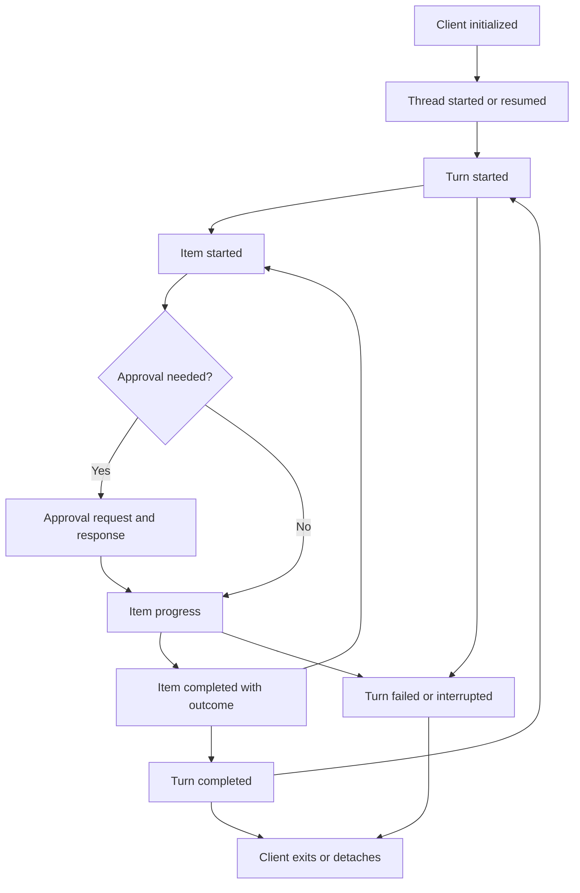

# Research report: Codex CLI observable lifecycle

Research date: **2026-09-06**. Scope: one Codex CLI agent, existing user-accessible surfaces, research only. Implements the deliverable in [Research Plan](RESEARCH_PLAN.md) and follows [Vision](VISION.md).

## Findings at a glance

**Recommend `codex exec --json` for a first, deliberately limited recorder.** It already emits JSONL with thread entry, turn boundaries, selected tool activity, results, messages, and usage. It is a projection of a richer app-server stream, not a complete execution transcript. Capture process outcome and stderr separately. A later app-server client would be needed for native turn IDs, output deltas, interactive approval exchanges, and compaction items. [S1–S5]

The most consequential findings at the pinned source revision are:

- `exec` uses an **in-process app server**. Old explanations that map legacy Core events directly into exec JSON are not the correct architecture for this revision. [S2, S3, S6]
- Exec generates `item_N` identifiers and removes native turn IDs and lifecycle timestamps. A resumed invocation can emit `thread.started` with an existing thread ID. [S2, S3]
- Exec filters text/output deltas, user-message items, and context-compaction items. `item.updated` is used for checklist updates; it is not a general tool-output stream. [S3]
- An interrupted app-server turn shuts down exec without a dedicated `turn.interrupted` or `turn.failed` JSON event. The process path records failure and exits nonzero; abrupt termination is an additional, separately unverified case. [S2, S3]
- Exec's `turn.completed.usage` copies the latest **accumulated total**, despite its type comments describing turn usage. If no usage notification reached the processor, zeros are substituted. Do not interpret these fields as independently measured per-turn counts. [S1, S3, S8]
- In-process delivery can drop events under backpressure. Exec reports a warning and attempts limited completion recovery from stored history; this does not recover the original timeline. [S2, S3]

These are **source findings**, not observed model runs. No recorder, exporter, replay program, or machine-readable schema was created or changed.

## 1. Version and evidence baseline

| Dimension | Examined baseline |
|---|---|
| Upstream | [`openai/codex` commit `ac192cd7937b0d73edc6dffe009940ae53782dd4`](https://github.com/openai/codex/commit/ac192cd7937b0d73edc6dffe009940ae53782dd4), resolved from `main` during this research; commit time `2026-09-06T07:42:32Z` |
| CLI release version | **Unavailable locally.** Upstream workspace manifest says `0.0.0`, a development placeholder, not a verified installed/released CLI version. This report pins the commit, not a release equivalence. [S0] |
| Local observation | `command -v codex` returned no executable path; `uname -sm` returned `Linux x86_64`. A search of available workspace/runtime locations found no usable CLI source checkout or executable before upstream retrieval. |
| Modes inspected | `codex exec --json`, exec resume and interruption paths; app-server v2 stdio protocol; interactive TUI's app-server session adapter; persisted rollout policy |
| Model/configuration | No model run, no model selected, no CLI authentication/configuration exercised. Source defaults and policy branches are discussed only where traced. |
| Repository baseline | Trajectory Lab `main` at `37d1241cb92d53dc56dc45c9a29980c47997a0d4`; README, Vision, Research Plan, and Roadmap read. Repository tree contained no `AGENTS.md`. |
| Public documentation | Official non-interactive and app-server documentation retrieved on 2026-09-06. These are rolling documentation, not immutable release specifications. [D1, D2] |
| Runtime limitations | No successful model/tool trace, cancellation test, approval test, resume test, timing measurement, or upstream test execution. No credentials or existing user session logs inspected. |

Evidence labels used here: **documented** means official interface documentation; **source** means an inspected implementation at the pinned commit; **observed** is limited to the local availability check above; **proposal** means a design recommendation. Test source supports intended behavior but is not a test result from this investigation.

Source takes precedence over broad comments or illustrative documentation where they differ. For example, an enum comment says file changes are completion-only, but the current JSON processor maps both started and completed file-change items. Likewise, the app-server lifecycle overview loosely associates usage with completion; the concrete notification types carry usage separately. [S1, S3–S5, S8]

## 2. Lifecycle map

This map describes exposed app-server boundaries. Exec retains only a subset. Arrows express lifecycle relationships, not universal ordering across concurrent work. [S2–S6]



**Connection, thread, turn, and process are different boundaries.** App-server stdio clients send `initialize`, then `initialized`, before other requests. `thread/start` creates a conversation; `thread/resume` loads an existing one. `turn/start` supplies input and returns a turn; `turn/started` marks when it runs. A turn can contain several model requests and tool executions. Normal, failed, and interrupted endings all use app-server `turn/completed`, distinguished by `turn.status`. Usage is a separate notification. [S4, S5, S8, S10]

Exec starts an in-process app-server client, resolves or starts the thread, emits its own `thread.started`, submits the turn, and processes selected notifications. On turn completion it requests unsubscribe and shuts down its client. JSON stream EOF describes the observation process ending; it is not a native thread-deletion event. Initialization can fail before a thread event exists. [S2, S3]

The interactive TUI uses an `AppServerSession` adapter with `start_thread` and `turn_start`; its adapter supports embedded and other server connections. The terminal display is a presentation surface, not this JSONL protocol. This research did not exercise terminal rendering or establish a passive way to mirror every notification of an arbitrary already-running TUI. [S14]

### Identifier meanings

| Identifier | Meaning and safe use |
|---|---|
| App-server `thread.id` / exec `thread_id` | Conversation identity. Record the returned value; it can be used to resume. A new exec process does not imply a new conversation. [S2, S4] |
| App-server `thread.sessionId` | Current live session-tree root identity in this revision. It is not a process ID or transport ID. Single-agent root threads use their own thread ID. No orchestration is proposed here. [S4, S5] |
| App-server `turn.id`, `turnId` | Turn identity. Exec's top-level turn events omit it. Never manufacture a native turn ID from event position. [S1, S3, S5] |
| App-server `item.id`, delta `itemId` | Correlate a specific item's start, progress, and completion within its thread/turn. The inspected command emitter uses Core `call_id` as item ID; do not generalize that equivalence to every item kind. [S5, S11] |
| Exec `item.id` | Locally generated `item_N`, mapped from native IDs for paired items. Counter starts afresh per processor. Scope by capture/invocation; never join different files solely on `item_0`. [S3] |
| JSON-RPC `id` / approval `requestId` | Request-response correlation, distinct from the target tool's `itemId`. Preserve direction because both client and server issue requests. [S4, S5] |
| Command `processId` | Terminal/process handle where provided by app-server; separate from a tool-call identity and not guaranteed to be an OS PID. Exec discards it. [S3, S5] |

## 3. Observable event inventory

**Stability key:** **E** = documented exec output, whose exact mapping is pinned here; **A** = ordinary documented app-server v2 surface, with version-specific fields; **X** = explicitly experimental/unstable; **I** = implementation-dependent persisted/internal format. “Documented” does not promise every field will remain unchanged across releases. App-server schema generation defaults to its stable surface; experimental features require separate opt-in. [S4]

### Exec stdout (`--json`)

All rows are **source-backed E**. These events lack a general source timestamp and sequence number. Arrival/line order is observable; source timing is not. [S1–S3]

| Native event / item type | Emission boundary and exposed fields | IDs and order | Limitations / evidence |
|---|---|---|---|
| `thread.started` | Initial configuration presentation; `thread_id` | Conversation ID, including resume path | Does not distinguish create from resume; not an OS-process-start marker. [S2, S3] |
| `turn.started` | Selected app-server turn-start notification; no additional fields | No native turn ID | Does not mean a single model request. [S1–S3] |
| `item.started`, `item.completed` / `command_execution` | Selected command lifecycle; `command`, `aggregated_output`, nullable `exit_code`, `status` | Paired exec item ID; other work may interleave | Status: `in_progress`, `completed`, `failed`, `declined`. Command is a display string. No raw arguments, cwd, process handle, duration, separate stderr, or live chunks. Missing aggregate becomes empty string. [S1, S3, S5, S13] |
| `item.started`, `item.completed` / `file_change` | Proposed/final patch item; `changes[{path,kind}]`, `status` | Paired when both received | Diffs and move destination detail are dropped; app-server `declined` maps to exec `failed`. Started emission is supported by current processor despite old enum comment. [S1, S3] |
| `item.started`, `item.completed` / `mcp_tool_call` | MCP invocation/result; `server`, `tool`, JSON `arguments`, nullable `result` and `error`, `status` | Paired item ID | Result carries `content`, `structured_content`, optional `_meta`; error retains message. Duration, app/plugin context, and capability hints dropped. Content is not guaranteed harmless or complete. [S1, S3, S15] |
| `item.started`, `item.completed` / `web_search` | Search lifecycle; query, action and search ID | Exec item ID plus search payload ID | Structured search results in app-server item are not mapped. No claim of a full retrieved corpus. [S1, S3, S5] |
| `item.completed` / `agent_message` | Completed agent message; `text` | New exec item ID; no matching start from processor | Text deltas, phase, citations metadata, delivery metadata, and structured questions are not retained here. [S3] |
| `item.completed` / `reasoning` | Only a nonempty, already-exposed summary, joined into `text` | New exec item ID | Public summary only; raw content not mapped. Outside the lab's default content scope; never label it hidden thought. [S1, S3] |
| `item.started`, `item.updated`, `item.completed` / `todo_list` | Plan/checklist notifications; `items[{text,completed}]` | One running checklist item; updates are snapshots | `pending` and `inProgress` both become `completed:false`; explanation dropped. Closure at turn end does not mean every step succeeded. Separate plan-mode text items are not mapped. [S3, S6] |
| `error` | App-server error; flattened `message` | No turn/request ID or timestamp | Retry flag and structured category lost. Can represent a retrying error despite enum's “unrecoverable” description. Do not stop parsing solely on this record. [S1–S3, S6] |
| `item.completed` / `error` | Warnings, deprecation/config notices, reroute notices, stream-lag warnings | Generated item ID | Nonfatal diagnostic category; distinct from `turn.failed`. Lag warning reports a dropped-event count in message text. [S2, S3] |
| `turn.completed` | Successful turn end; `usage` with input, cached input, cache-write input, output, reasoning-output token counts | No turn ID | Copies latest total, zero-default if missing. Not direct per-request usage, cache residency, or private reasoning content. [S1, S3, S8] |
| `turn.failed` | Failed status; `error.message` | No turn ID | Does not represent all interrupted or abruptly terminated runs. [S2, S3] |

The exec union also contains `collab_tool_call`. That capability belongs to Codex, but multi-agent capture is outside this research phase. Its existence does not expand Trajectory Lab's scope. Unknown or out-of-scope records must not be reinterpreted as single-agent tool events. [S1, S3]

### App-server and other surfaces

| Surface / native event | Boundary and exposed fields | IDs, order and timing | Stability, access and limits |
|---|---|---|---|
| App-server `thread/started`; `thread/start`, `thread/resume` responses | Thread entry and metadata | Thread ID; resume does not imply fresh history | **A**, initialized client and applicable local auth/config. Starting an independent server is not a passive tap on the TUI. [S4] |
| `turn/started`, `turn/completed` | `threadId`, turn object, final status/error, `itemsView` | Native turn ID; nullable `startedAt`/`completedAt` in **seconds**, `durationMs` in milliseconds | **A**. Completion contains a summary or no loaded items, not the complete item stream; inspect `itemsView`. Usage separate. [S5, S6] |
| `item/started`, `item/completed` | Native typed item, `threadId`, `turnId`; `startedAtMs` / `completedAtMs` | Millisecond lifecycle timestamps; item ID shared by deltas | **A**. Includes user messages, command/MCP/file items, etc.; native payload retains more than exec. State at item completion is not proof of complete transport capture. [S5, S6] |
| `item/agentMessage/delta` | Text `delta` | Thread, turn, item IDs; append in received order | **A**. Final item authoritative; no guarantee of byte-identical model transport or complete context. [S4, S5] |
| `item/commandExecution/outputDelta` | Text `delta` | Thread, turn, item IDs; no stdout/stderr discriminator in this v2 DTO | **A**. Unified-exec delta emission has a count limit and 8,192-byte chunk bound; retained transcript is capped separately. Exec filters these notifications. [S2, S5, S12] |
| `item/started`, `item/completed` / `contextCompaction` | Compaction boundary; item ID | Normal item correlation; automatic or requested compaction | **A**. Establishes compaction activity, not exact before/after model context. Deprecated legacy `thread/compacted` is not the recommended interface. Exec drops this item. [S3, S4, S6] |
| `thread/tokenUsage/updated` | `tokenUsage:{total,last,modelContextWindow}` | Thread and turn IDs | **A**. Core accumulated and last usage mapping; nullable context-window value. Not per-layer KV telemetry. Exec maps total only. [S3, S8] |
| `turn/plan/updated`, `turn/diff/updated` | Checklist with explanation; latest unified diff | Thread and turn IDs; snapshots supersede earlier values | **A**. Exec simplifies checklist and drops diff notification. [S3, S5, S6] |
| `item/commandExecution/requestApproval`, `item/fileChange/requestApproval`; `serverRequest/resolved` | Server request, client decision, resolution/cleanup notification | RPC request ID plus thread/turn/item references; optional approval-specific ID | **A** with some experimental fields. `item.started` can precede approval and thus precede execution. Resolved may mean cleanup, not acceptance. Exec rejects interactive approval requests instead of exposing an approval UI. [S2, S4, S5] |
| App-server `error` | Error object and `willRetry` | Thread and turn IDs | **A**. Retry error and failed terminal turn are different observations. [S5, S6] |
| `item/autoApprovalReview/*`; `rawResponseItem/completed`, `rawResponse/completed` | Auto-review or raw compatibility information | Surface-specific IDs | **X / internal-only as documented**. Excluded from proposed capture. Do not enable raw-event capabilities to pursue private reasoning or presumed full model context. [S4, S8] |
| `thread/read`, `thread/turns/list`, `thread/items/list` | Reconstructed persisted history | Native IDs; pagination and `itemsView` describe coverage | **A** read interfaces; not playback of all live notifications. Full hydration is deprecated for paginated threads; prefer paging where applicable. [S4, S5] |
| Local rollout JSONL: e.g. `session_meta`, `response_item`, `event_msg`, `compacted`, `turn_context` | Selected persisted records | Writer timestamp, optional ordinal, type/payload; format depends on history mode | **I**, access to owned Codex state. Legacy and paginated persistence differ; starts, deltas and approvals are often transient. Ephemeral sessions have no persisted rollout. Avoid treating raw files as a stable API. [S4, S7] |
| Interactive terminal; exec human output; tracing stderr | Rendered progress, final text, diagnostics | No universal machine correlation contract | User-accessible, presentation/log formats. App-server supports `RUST_LOG` and `LOG_FORMAT=json`; these diagnostics are not protocol events. Keep stderr separate. [S2, S4, S14] |

### Ordering, buffering and output transformations

The inspected tool runtime admits parallel-safe tools under a shared lock and serial-only tools under an exclusive lock. Its tool futures are later drained through `FuturesOrdered` into conversation history. Therefore execution completion order, user-notification arrival order, and history insertion order are not interchangeable. No global causal clock was established. Record arrival order and join only on actual identifiers. [S9, S10]

Exec uses `println!` for each serialized event. This establishes JSONL framing, not an end-to-end latency guarantee through pipes and consumers. In-process `Lagged` events produce a warning; before shutdown, non-ephemeral exec may fetch `thread/read` and reconcile items whose starts were received. It does not synthesize every missing item or recover lost deltas/timestamps. Recovery can place an item completion late in the observed sequence. [S2, S3]

Command display strings redact recognizable secrets and shell-format arguments. This is not a guarantee that all output, arguments, paths, or MCP metadata are sanitized. Unified exec retains a head/tail buffer, can omit middle bytes with a marker, and uses lossy UTF-8 conversion for aggregate text. The v2 command item does not expose separate stdout/stderr, and exec further loses null-versus-empty aggregate information. Preserve what was emitted; never describe it as exact subprocess bytes or exact model-visible tool output. [S3, S5, S12, S13]

## 4. Tool-call/result walkthrough

**Source walkthrough, not a runtime trace.** The example action is a benign command that prints a marker. Its exact shell spelling, choice of tool, execution, and result have not been observed here.

| Stage | Verified source path / symbol | What crosses the boundary |
|---|---|---|
| Model-facing response arrives | `session/turn.rs`, `ResponseEvent::OutputItemDone`; `stream_events_utils::handle_output_item_done` | A completed response item is examined. A function/custom call contains tool name, arguments/input, and `call_id`. This internal response is not itself an exec event. [S9, S10] |
| Request routed | `ToolRouter::build_tool_call`; `ToolCallRuntime::handle_tool_call` | Builds a `ToolCall`, records the response item, schedules handler execution through the runtime/registry. Tool errors can become outputs to the model. [S9] |
| Command becomes visible | `tools/events.rs::emit_exec_command_begin`, `ToolEmitter` | Emits canonical `TurnItem::CommandExecution`, ID derived from call ID; approval handling may already have emitted a start. A start is not proof the process has run. [S6, S11] |
| Progress and terminal result | `unified_exec/async_watcher.rs`, `tools/events.rs` | Output notifications and final command item carry available aggregate, status, exit code and duration. Bounded output may omit data. Long-running terminals add separate lifecycle complexity. [S11, S12] |
| Result returns to conversation | `ToolCallRuntime::handle_tool_call`, `session/turn.rs::drain_in_flight` | Handler result becomes a response envelope; conversation history records it for follow-up. Ordinary paired function outputs are not separately exposed as v2 `functionCallOutput` items. [S4, S9, S10] |
| Core item reaches public API | `bespoke_event_handling.rs`, `EventMsg::ItemStarted` / `ItemCompleted`; v2 `ThreadItem` conversion | Canonical item lifecycle becomes app-server notifications, with display redaction and native IDs. Deprecated `ExecCommandBegin/End` and MCP begin/end are explicitly not the v2 item route here. [S5, S6, S13] |
| Exec projects the item | `should_process_notification`; `map_started_item`, `map_completed_item_mut`, `map_item_with_id`, `emit` | Prints paired `item.started` / `item.completed` with generated ID, display command, aggregate, status and exit code. Deltas, native turn/call IDs, cwd and duration are dropped. [S2, S3] |

### Reproduction procedure — not performed

Use an installed, authenticated CLI in a disposable directory and record its actual version first. Inspect effective model/provider, sandbox, approval policy/reviewer, enabled tools/features, history mode and config overrides with secrets omitted. Do not assume an installed release matches this development commit. The commands below are observation commands, not a recorder implementation.

```bash
codex --version
codex exec --help
codex exec resume --help
uname -sm

research_dir=$(mktemp -d)
cd "$research_dir"
git init -q
codex exec --json --sandbox read-only \
  'Use a shell tool once to print TRAJECTORY_LAB_PROBE, then report the result. Do not modify files, use network tools, or delegate.' \
  > events.jsonl 2> diagnostics.txt
probe_exit=$?
printf '%s\n' "$probe_exit" > exit-status.txt
```

Review that a command actually ran and correlate its start/completion by the **received** item ID. Check status, output marker, final message and terminal event without presuming their exact content or count. Keep raw artifacts private until reviewed and sanitized; label any published edits to excerpts.

Then, in separate captures, use `codex exec --json resume <THREAD_ID> '<benign follow-up>'` with the actual emitted ID; compare IDs and usage rather than assuming counters reset. A controlled foreground interrupt can assess cancellation, but absence of a terminal JSON event must be recorded as incomplete/unknown without process evidence. An optional separate `--ephemeral` run tests the no-history case; it cannot supply the same history backfill or later resume evidence. [S2–S4]

For app-server verification, first generate its version-matched stable schema using `codex app-server generate-json-schema --out <temporary-directory>`. An existing client can perform initialization, thread start, turn start, and one benign command while retaining both protocol directions. Do not build such a client as part of this research handoff, or count this procedure as an executed test. [S4]

## 5. Coverage and gaps

| Question | Established | Still unavailable or unverified |
|---|---|---|
| Where did this observation begin? | Process capture boundary; exposed thread/turn boundaries where retained | Full prior history from a resumed exec stream alone |
| What tool activity happened? | Selected command/MCP/file/search lifecycle and emitted results | Every tool type, raw arguments for every command, precise timing in exec |
| Was approval requested? | App-server server request/response can establish the exchange | Exec does not preserve an interactive approval transcript; a declined item alone does not explain all policy decisions |
| Was output complete? | Emitted aggregate/deltas and any explicit omission or lag markers | Silent losses, byte-exact original output, transport health solely from EOF |
| Did the run finish? | Successful/failed native turn event, or app-server interrupted status; separately process exit | Crash/signal cause from JSON alone; absence of an event does not prove absence of activity |
| What happened to context? | Compaction boundary on app-server; selected persisted records | Complete model inputs, hidden reasoning, private state, why a choice was made, per-layer KV/cache contents |
| Can history replace a live log? | Some canonical state is recoverable through supported history reads | Transient starts, chunks, approval exchanges, original arrival timing; persistence policy excludes many live events |

This matrix synthesizes the mappings and persistence rules above. [S1–S13] Existing exposed summaries are not evidence of hidden chain of thought. Aggregate reasoning-token counts are counts only. Capturing raw compatibility records would not justify claims of complete model-context reconstruction.

## 6. Capture recommendation

**Proposal: one noninteractive, single-agent invocation captured through exec JSON stdout, plus separate invocation metadata, stderr and process outcome.** This is the smallest existing surface sufficient to teach entry → selected tool activity → visible result → turn outcome. It requires no Codex fork or internal instrumentation. Its omissions must remain visible in the resulting viewer. [S1–S3]

Choose app-server v2 instead if native turn IDs, lifecycle timestamps, approval interactions, streamed output, or compaction are requirements for the *first* recorder. That means owning a protocol connection/client lifecycle, handling bidirectional requests correctly, and preserving configuration semantics. It is a larger milestone, and this research has not demonstrated a transparent attachment to an arbitrary existing interactive session. [S4, S5, S14]

Redirecting stdout can record an existing exec run without changing its tool policy. Switching an interactive task to exec **can** change behavior: headless approval handling differs, and the source normally selects never-ask policy with an auto-review-specific configuration branch. Adding ephemeral mode changes persistence and recovery. Document mode/configuration instead of describing the experiment as perfectly nonintrusive. [S2]

Do not make raw rollout parsing the first adapter. Rollouts are useful corroborating local evidence, but their selective, evolving storage policy and history migration make them a poor universal live-event contract. Supported history APIs are preferable when later recovery is needed. [S4, S7]

## 7. Schema considerations — proposal only

Do not reuse the legacy task/trajectory schemas as the event contract. No machine-readable schema is finalized by this report.

| Proposed envelope field | Provenance and meaning |
|---|---|
| `format_version` | Lab-owned envelope revision, distinct from CLI version |
| `capture_id` | Lab-generated identifier for this invocation/connection capture, not a Codex session ID |
| `sequence` | Lab-assigned ordinal in the selected stream, not a source causal sequence |
| `surface` | Explicit value such as `codex.exec.jsonl` |
| `source_version`, `source_commit` | Actual measured executable version and verified commit if known; otherwise explicit null with limitation |
| `observed_at` | Optional collector receipt time; never backfilled as execution time |
| `native` | Original parsed event payload; retain unknown keys and explicit nulls |

Store exact received lines separately if byte fidelity is a requirement: parsing and serializing JSON can alter whitespace and key order. A checksum can identify bytes but cannot prove source completeness. Keep metadata referencing prompt/configuration/process outcome distinct from native events. Do not insert invented native startup or interruption events.

Native IDs can remain inside the payload. If indexed separately, retain the native field path and distinguish an explicitly present ID from capture-level association. Exec turn ID and source timestamp are absent: leave them unavailable. Preserve native zeros while documenting the usage processor's defaulting ambiguity; do not silently turn them into measured zero or replace them with null.

Treat sanitization as a separate transformation with recorded field paths and reason. Retaining native payloads does not require publishing sensitive payloads. For this phase, visible reasoning-summary text should be excluded from default display/capture content policy or explicitly marked as already-exposed summary if retained after review; never seek raw/private reasoning. Scope exclusions must be recorded rather than silently masquerading as complete capture.

## 8. JSONL and replay feasibility

**Feasible:** preserve the selected native stream in order; display lifecycle records and final text; group exec command/MCP start and result by invocation-scoped item ID; show checklist snapshots, warnings, unknown types and missing terminal state. App-server can additionally support streamed display and native timing when those fields were captured. These are replayed observations, not new model/tool executions.

**Not feasible from exec alone:** reconstruct text streaming, approval exchanges, omitted diffs, compaction, original native IDs, source-time intervals, every tool argument, exact subprocess bytes, or the full conversation before a resume. Do not infer “no compaction” from no compaction record, “no tool activity” from a filtered type, or “success” from clean EOF.

Live app-server replay must distinguish deltas from final snapshots so output is not doubled. Persisted-history recovery must be marked as recovered state rather than inserted as though received live. A final item supersedes a display snapshot, but the original event remains available for inspection. Rollout writer timestamps are assigned during writing and are not interchangeable with item lifecycle timestamps. [S3, S5, S7, S12]

## 9. Open questions and next step

1. Which installed CLI release will the lab target, and does its output match this commit's projection? A real `codex --version` plus a benign trace is the first missing evidence.
2. Under that release, what events and process outcomes occur for SIGINT, hard termination, startup failure, and a blocked command? The source path is mapped; empirical results remain open.
3. How often are usage updates missing or restored on resume, and how do accumulated values behave across multiple model requests? Do not derive per-turn costs before validation.
4. What evidence remains under in-process lag, ephemeral mode, and history backfill? No loss/latency guarantees were measured.
5. Which enabled tool modes emit only item types omitted by exec? Validate the actual configuration before promising general tool coverage.
6. Is there an existing supported attachment/logging route that preserves the user's chosen interactive TUI behavior while exposing needed notifications? Not established here.

**One proposed implementation milestone, for later review:** build a minimal single-invocation exec capture adapter with provenance and explicit incomplete-run handling. Its first validation uses one actual benign shell task; subsequent acceptance cases cover failed/interrupted input and unknown native records. It records stdout, separates stderr and process outcome, and scopes generated item IDs by capture. It does not build a replay UI, add app-server control, modify Codex, or enable additional agents. Schema agreement is part of reviewing this milestone, not a completed deliverable here.

Research milestones 1–2 are delivered at the **source/documentation level** with runtime limitations above. Milestones 3–5 remain future work.

## Evidence index

All **S** links are immutable at the examined commit. Symbols named here are the source anchors for this report; internal symbols are not claimed as public endpoints. **D** links are rolling official documentation, retrieved 2026-09-06.

- **S0:** [`codex-rs/Cargo.toml`](https://github.com/openai/codex/blob/ac192cd7937b0d73edc6dffe009940ae53782dd4/codex-rs/Cargo.toml), `workspace.package.version`.
- **S1:** [`exec/src/exec_events.rs`](https://github.com/openai/codex/blob/ac192cd7937b0d73edc6dffe009940ae53782dd4/codex-rs/exec/src/exec_events.rs), `ThreadEvent`, `ThreadItemDetails`, `Usage`, command/MCP/file item types.
- **S2:** [`exec/src/lib.rs`](https://github.com/openai/codex/blob/ac192cd7937b0d73edc6dffe009940ae53782dd4/codex-rs/exec/src/lib.rs), `run_exec_session`, `build_exec_config`, `should_process_notification`, `maybe_backfill_turn_completed_items`, `handle_server_request`, `request_shutdown`; [`exec/src/cli.rs`](https://github.com/openai/codex/blob/ac192cd7937b0d73edc6dffe009940ae53782dd4/codex-rs/exec/src/cli.rs), `Cli`, `ResumeArgs`.
- **S3:** [`exec/src/event_processor_with_jsonl_output.rs`](https://github.com/openai/codex/blob/ac192cd7937b0d73edc6dffe009940ae53782dd4/codex-rs/exec/src/event_processor_with_jsonl_output.rs), `EventProcessorWithJsonOutput`, `collect_thread_events`, `map_item_with_id`, ID mapping, `usage_from_last_total`, `reconcile_unfinished_started_items`, `emit`.
- **S4:** [`app-server/README.md`](https://github.com/openai/codex/blob/ac192cd7937b0d73edc6dffe009940ae53782dd4/codex-rs/app-server/README.md), Protocol, Lifecycle Overview, Events, Approvals, Experimental API Opt-in, resume/history/compaction examples.
- **S5:** App-server v2 types: [`item.rs`](https://github.com/openai/codex/blob/ac192cd7937b0d73edc6dffe009940ae53782dd4/codex-rs/app-server-protocol/src/protocol/v2/item.rs), `ThreadItem`, lifecycle/delta/approval types and Core conversion; [`turn.rs`](https://github.com/openai/codex/blob/ac192cd7937b0d73edc6dffe009940ae53782dd4/codex-rs/app-server-protocol/src/protocol/v2/turn.rs), start/completion/plan/diff types; [`thread_data.rs`](https://github.com/openai/codex/blob/ac192cd7937b0d73edc6dffe009940ae53782dd4/codex-rs/app-server-protocol/src/protocol/v2/thread_data.rs), `Thread`, `Turn`, `TurnItemsView`; [`notification.rs`](https://github.com/openai/codex/blob/ac192cd7937b0d73edc6dffe009940ae53782dd4/codex-rs/app-server-protocol/src/protocol/v2/notification.rs), `ErrorNotification`.
- **S6:** [`app-server/src/bespoke_event_handling.rs`](https://github.com/openai/codex/blob/ac192cd7937b0d73edc6dffe009940ae53782dd4/codex-rs/app-server/src/bespoke_event_handling.rs), canonical item branches, deprecated-event branches, `emit_turn_completed_with_status`, stream-error and approval handling.
- **S7:** [`rollout/src/policy.rs`](https://github.com/openai/codex/blob/ac192cd7937b0d73edc6dffe009940ae53782dd4/codex-rs/rollout/src/policy.rs), `is_persisted_rollout_item`, `should_persist_event_msg`; [`rollout/src/recorder.rs`](https://github.com/openai/codex/blob/ac192cd7937b0d73edc6dffe009940ae53782dd4/codex-rs/rollout/src/recorder.rs), `RolloutRecorder`, `RolloutLineRef`, `JsonlWriter::write_rollout_item`; [`history/src/rollout_payload.rs`](https://github.com/openai/codex/blob/ac192cd7937b0d73edc6dffe009940ae53782dd4/codex-rs/history/src/rollout_payload.rs), `RolloutItemWire`; [`rollout/src/lib.rs`](https://github.com/openai/codex/blob/ac192cd7937b0d73edc6dffe009940ae53782dd4/codex-rs/rollout/src/lib.rs), `decode_rollout_line` and history-type re-exports.
- **S8:** [`app-server-protocol/src/protocol/v2/thread.rs`](https://github.com/openai/codex/blob/ac192cd7937b0d73edc6dffe009940ae53782dd4/codex-rs/app-server-protocol/src/protocol/v2/thread.rs), `ThreadTokenUsageUpdatedNotification`, `ThreadTokenUsage`, `TokenUsageBreakdown`, Core usage conversion, `RawResponseCompletedNotification`.
- **S9:** [`core/src/stream_events_utils.rs`](https://github.com/openai/codex/blob/ac192cd7937b0d73edc6dffe009940ae53782dd4/codex-rs/core/src/stream_events_utils.rs), `handle_output_item_done`; [`core/src/tools/router.rs`](https://github.com/openai/codex/blob/ac192cd7937b0d73edc6dffe009940ae53782dd4/codex-rs/core/src/tools/router.rs), `ToolRouter::build_tool_call` and dispatch; [`core/src/tools/parallel.rs`](https://github.com/openai/codex/blob/ac192cd7937b0d73edc6dffe009940ae53782dd4/codex-rs/core/src/tools/parallel.rs), `ToolCallRuntime`, parallel gate and result/error conversion.
- **S10:** [`core/src/session/turn.rs`](https://github.com/openai/codex/blob/ac192cd7937b0d73edc6dffe009940ae53782dd4/codex-rs/core/src/session/turn.rs), response-event loop and `drain_in_flight`.
- **S11:** [`core/src/tools/events.rs`](https://github.com/openai/codex/blob/ac192cd7937b0d73edc6dffe009940ae53782dd4/codex-rs/core/src/tools/events.rs), `ToolEmitter`, `emit_exec_command_begin`, command-result item construction.
- **S12:** [`core/src/unified_exec/async_watcher.rs`](https://github.com/openai/codex/blob/ac192cd7937b0d73edc6dffe009940ae53782dd4/codex-rs/core/src/unified_exec/async_watcher.rs), `Emitter::emit`, chunk limit and `resolve_aggregated_output`; [`head_tail_buffer.rs`](https://github.com/openai/codex/blob/ac192cd7937b0d73edc6dffe009940ae53782dd4/codex-rs/core/src/unified_exec/head_tail_buffer.rs), `HeadTailBuffer` and omission marker.
- **S13:** [`app-server-protocol/src/protocol/item_builders.rs`](https://github.com/openai/codex/blob/ac192cd7937b0d73edc6dffe009940ae53782dd4/codex-rs/app-server-protocol/src/protocol/item_builders.rs), `CommandExecutionPresentation::from_raw`.
- **S14:** [`tui/src/app_server_session.rs`](https://github.com/openai/codex/blob/ac192cd7937b0d73edc6dffe009940ae53782dd4/codex-rs/tui/src/app_server_session.rs), `AppServerSession`, `uses_embedded_app_server`, `start_thread`, `turn_start`.
- **S15:** [`exec/src/event_processor_with_jsonl_output_tests.rs`](https://github.com/openai/codex/blob/ac192cd7937b0d73edc6dffe009940ae53782dd4/codex-rs/exec/src/event_processor_with_jsonl_output_tests.rs), warning, failed final-output and MCP `_meta` assertions. **Read, not executed.**
- **D1:** [Official non-interactive mode documentation](https://learn.chatgpt.com/docs/non-interactive-mode), JSONL output and resume.
- **D2:** [Official app-server documentation](https://learn.chatgpt.com/docs/app-server), protocol, item deltas, approvals and compaction.
